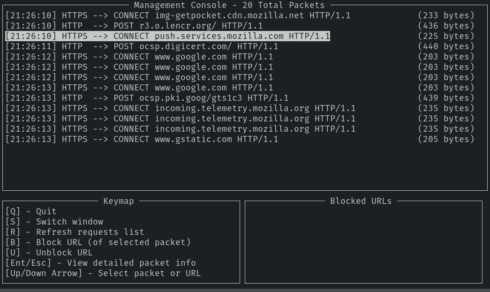
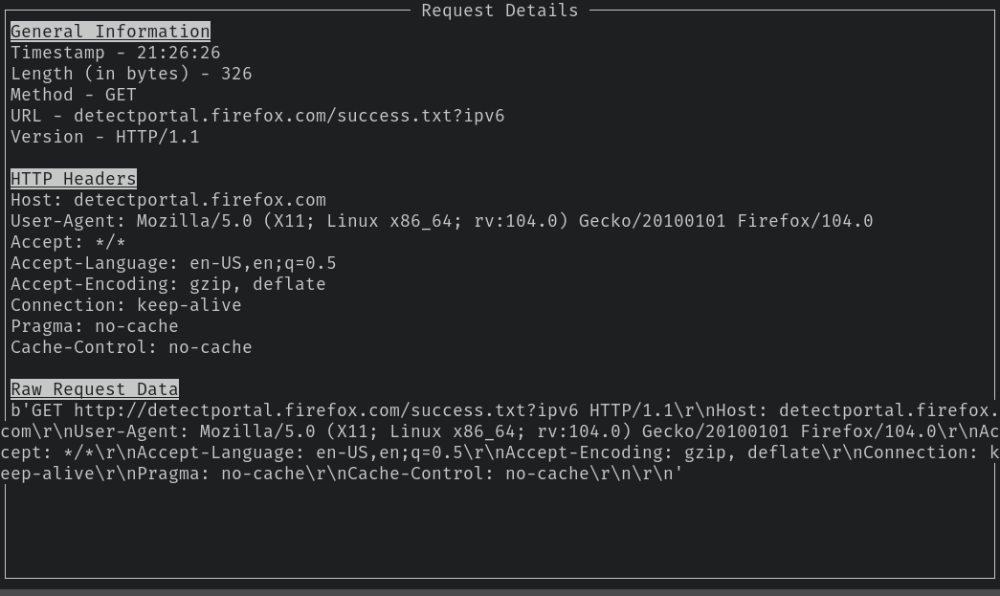
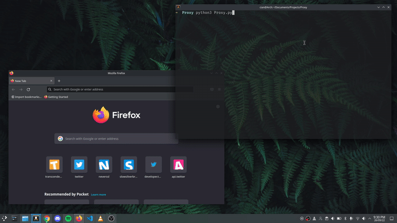

# Python Web Proxy

## Details

This project implements a HTTP/HTTPS web proxy in Python.

It implements multithreaded request handling, custom HTTP parsing and web sockets for HTTPS.
It also features a simple UI for viewing, blocking and caching HTTP request data.

A detailed explanation of the implementation can be found in `report.pdf`.

## Media

### Main UI



### Request Details UI



### Live Demo of Blocking URL



## Running

With `python` installed simply run

```
> python3 Proxy.py
```

to start the proxy. By default it runs on `localhost` with port `8080`. This can be changed by modifying the `PROXY_HOST` and `PROXY_PORT` variables in `Proxy.py`.

To connect a browser to the proxy simply search for the proxy settings in the browser. I showcase firefox in the above demo video.
